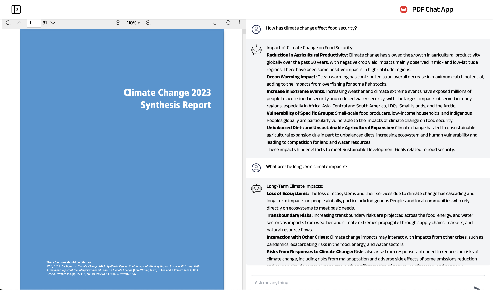

## RAG Demo using Couchbase, NextJS, LangChain, and OpenAI

This is a demo app built to chat with your custom PDFs using the vector search capabilities of Couchbase to augment the OpenAI results in a Retrieval-Augmented-Generation (RAG) model.

For the full tutorial, please visit the [Developer Portal](https://developer.couchbase.com/tutorial-nodejs-langchain-pdf-chat).



### How does it work?

You can upload your PDFs with custom data & ask questions about the data in the chat box.

For each question, you will get an answer using RAG (Couchbase logo)

For RAG, we are using LangChain, Couchbase Vector Search & OpenAI. We fetch parts of the PDF relevant to the question using Vector search & add it as the context to the LLM. The LLM is instructed to answer based on the context from the Vector Store.

### How to Run

- #### Install dependencies

  `npm install`

- #### Set the environment secrets

  Copy the `.env.template` file in and rename it to `.env` (`.env.local` in case of local development) and replace the placeholders with the actual values for your environment

  ```
  OPENAI_API_KEY=<open_ai_api_key>
  DB_CONN_STR=<connection_string_for_couchbase_cluster>
  DB_USERNAME=<username_for_couchbase_cluster>
  DB_PASSWORD=<password_for_couchbase_cluster>
  DB_BUCKET=<name_of_bucket_to_store_documents>
  DB_SCOPE=<name_of_scope_to_store_documents>
  DB_COLLECTION=<name_of_collection_to_store_documents>
  INDEX_NAME=<name_of_fts_index_with_vector_support>
  ```

- #### Create the Search Index on Full Text Service

  We need to create the Search Index on the Full Text Service in Couchbase. For this demo, you can import the following index using the instructions.

  - [Couchbase Capella](https://docs.couchbase.com/cloud/search/import-search-index.html)

    - Copy the index definition to a new file index.json
    - Import the file in Capella using the instructions in the documentation.
    - Click on Create Index to create the index.

  - [Couchbase Server](https://docs.couchbase.com/server/current/search/import-search-index.html)

    - Click on Search -> Add Index -> Import
    - Copy the following Index definition in the Import screen
    - Click on Create Index to create the index.

  #### Index Definition

  Here, we are creating the index `pdf_search` on the documents in the `docs` collection within the `shared` scope in the bucket `pdf-docs`. The Vector field is set to `embeddings` with 1536 dimensions and the text field set to `text`. We are also indexing and storing all the fields under `metadata` in the document as a dynamic mapping to account for varying document structures. The similarity metric is set to dot_product. If there is a change in these parameters, please adapt the index accordingly.

  ```
  {
    "name": "pdf_search",
    "type": "fulltext-index",
    "params": {
        "doc_config": {
            "docid_prefix_delim": "",
            "docid_regexp": "",
            "mode": "scope.collection.type_field",
            "type_field": "type"
        },
        "mapping": {
            "default_analyzer": "standard",
            "default_datetime_parser": "dateTimeOptional",
            "default_field": "_all",
            "default_mapping": {
                "dynamic": true,
                "enabled": false
            },
            "default_type": "_default",
            "docvalues_dynamic": false,
            "index_dynamic": true,
            "store_dynamic": false,
            "type_field": "_type",
            "types": {
                "shared.docs": {
                    "dynamic": true,
                    "enabled": true,
                    "properties": {
                        "embedding": {
                            "enabled": true,
                            "dynamic": false,
                            "fields": [
                                {
                                    "dims": 1536,
                                    "index": true,
                                    "name": "embedding",
                                    "similarity": "dot_product",
                                    "type": "vector",
                                    "vector_index_optimized_for": "recall"
                                }
                            ]
                        },
                        "text": {
                            "enabled": true,
                            "dynamic": false,
                            "fields": [
                                {
                                    "index": true,
                                    "name": "text",
                                    "store": true,
                                    "type": "text"
                                }
                            ]
                        }
                    }
                }
            }
        },
        "store": {
            "indexType": "scorch",
            "segmentVersion": 16
        }
    },
    "sourceType": "gocbcore",
    "sourceName": "pdf-docs",
    "sourceParams": {},
    "planParams": {
        "maxPartitionsPerPIndex": 64,
        "indexPartitions": 16,
        "numReplicas": 0
    }
  }
  ```

- #### Run the application locally

  `npm run dev`
  This will run the application at localhost:3000 or other port mentioned in the run logs based on config.

